# marketplace architecture

this project describes a marketplace where sellers list products and buyers browse a personal feed, place orders and pay for them.

the code contains a single service, `catalog-service`, with a `/health` endpoint. it runs in docker and has no business logic. the sections below describe the planned marketplace.

## run the project

you need docker desktop with docker compose, and docker must be running.

```bash
git clone https://github.com/dvank1mang1/service-oriented_architectures_hw1.git
cd service-oriented_architectures_hw1
docker compose up --build -d --wait
curl -i http://localhost:8080/health
```

the endpoint returns status code `200` and this body:

```json
{"status":"ok","service":"catalog-service"}
```

`/health` checks that the service responds. other paths return status code `404`.

check the container status:

```bash
docker compose ps
```

the status should include `healthy`. if startup fails, check the logs:

```bash
docker compose logs catalog-service
```

to stop the project:

```bash
docker compose down
```

you can also run the service without docker. this needs python 3.13, with no extra packages:

```bash
python3 -m src.catalog_service
```

leave that terminal open and run the health check in another terminal.

## the architecture



the [diagram source](docs/c4-container.mmd) is editable. open the [full-size diagram](docs/c4-container.svg) to read the labels.

this is a c4 container diagram. here, a container means an application or a data store, not necessarily a docker container. the diagram shows the planned system; only the catalog service skeleton is running in this project.

people and external providers sit outside the marketplace boundary. blue boxes are applications, light cylinders are data stores, and grey boxes are external systems. each element has a name, type, technology and short description.

an arrow points from the caller or sender to the receiver. a solid line is a direct call, usually with an immediate reply. a dotted line is an event or a callback that arrives later. the labels show what is sent and which protocol is used.

mermaid draws the c4 model using its flowchart layout so that the connections and labels stay readable.

## domains, services and data

the marketplace has six business domains: users, catalog, feed, orders, payments and notifications. each has its own service and owns its data.

| service | what it does and owns | why it is separate |
|---|---|---|
| identity | buyer and seller accounts, profiles, roles, contacts and notification preferences | account access and personal details have their own rules |
| catalog | products, categories, seller offers, prices, stock, reservations and product images | it is the place to check the current price and available stock |
| feed | product search, ranking, browsing signals, interest scores and cached feed pages | browsing can have much more traffic than checkout and can use slightly older data |
| order | carts, order items, saved prices, totals, delivery addresses and status history | it owns the order and coordinates the steps needed to place it |
| payment | payment requests, provider references, accounting entries, fees and refunds | payment records need careful handling of retries and a clear history |
| notification | message templates, copied contact preferences, delivery attempts and results | a slow email or sms provider should not hold up an order |

the other parts support these services:

- the web app is the buyer and seller interface;
- the api gateway handles encrypted connections, request limits and routing;
- rabbitmq carries events between services;
- the external payment provider handles the payment page and card details;
- the external email or sms provider delivers messages.

### who can read and change data

there are no shared databases between services. each service uses its own credentials and can only access its own stores. another service must use its api or consume its events.

identity, catalog, order, payment and notification each have a separate postgresql database. catalog also owns s3-compatible image storage. feed owns an opensearch index and redis for interest scores and cached pages.

a copy does not change ownership. for example, feed keeps a searchable copy of product data, but catalog still owns the product. an order keeps the price agreed at checkout, while catalog owns the current selling price. notification keeps a copy of contact details, while identity owns the original profile.

the gateway and web app do not own business records. rabbitmq holds messages until they are handled, but it is not the permanent record of orders or payments. failed messages go to a separate queue for inspection and retry.

## how services talk to each other

a synchronous call waits for a reply. we use it when the next step needs an answer now. an asynchronous event tells other services about something that has already happened.

| connection | method | purpose |
|---|---|---|
| web app to gateway | synchronous https/json | send user requests |
| gateway to identity, catalog, feed or order | synchronous http/json | forward each request to the right service |
| order to catalog | synchronous http/json | check prices, reserve stock, confirm or release a reservation |
| order to payment | synchronous http/json | create a payment request, check its status or request a refund |
| feed to catalog | synchronous http/json | get a product snapshot when rebuilding the search index |
| payment to payment provider | synchronous https/json | create payments, check uncertain results and request refunds |
| payment provider to payment | asynchronous https webhook | report a payment result, with a signature that payment verifies |
| identity, catalog, order and payment to rabbitmq | asynchronous amqp | publish profile, product, stock, cart, order and payment changes |
| rabbitmq to feed | asynchronous amqp | update product copies and use cart or purchase activity for ranking |
| rabbitmq to order | asynchronous amqp | apply the payment result to the order |
| rabbitmq to notification | asynchronous amqp | update copied contacts and send messages about order status |
| notification to message provider | synchronous https/json from a background worker | submit a message without making checkout wait |
| web app to payment provider | https | let the buyer pay on the provider's page |

### retries and failures

each data-owning service saves a change and its outgoing event in the same local database transaction. the outgoing event is stored in an outbox table. a background worker sends it to rabbitmq and waits for confirmation.

a message can arrive more than once. receivers remember event ids so they do not apply the same change twice. events also carry a record id and version, which helps receivers ignore older updates.

commands such as creating a payment use an idempotency key: repeating the same request with the same key returns the existing result instead of creating a second payment.

there is no single transaction covering every service. if one step fails after another has succeeded, the system needs a follow-up action, such as releasing stock or refunding a payment.

## what happens when someone places an order

1. order saves a draft and the request key before calling another service.
2. catalog checks current prices and reserves all requested items together. the reservation has an expiry time. if a price changed, the buyer needs to confirm it.
3. order saves the agreed prices and total, then asks payment to create a payment request for that order.
4. payment gets a checkout link from the provider. the buyer follows it and pays on the provider's page.
5. payment verifies the provider's callback, saves the result and accounting entries, and publishes an event. returning to the shop page alone does not prove that payment succeeded.
6. order receives the result, confirms the stock reservation and marks the order as paid. its status event tells notification to send a message.

a timeout does not prove that a payment failed. payment checks the result with the provider, and order retries unfinished steps using the same request keys.

unpaid reservations expire. if a successful payment arrives after the stock reservation has expired, order requests a refund and tracks it until completion. if a service fails just after confirming a reservation, a retry returns the saved result for that order.

### payment calculation and records

the design assumes one currency, rubles, with no discounts, tax calculation or delivery charge.

order calculates the total as the sum of each saved item price multiplied by its quantity. amounts use whole kopecks rather than floating-point numbers.

payment accepts the amount from order, checks it against the provider's result and keeps a permanent accounting history. each movement has matching debit and credit entries. payment also calculates the platform fee and the amount owed to each seller using the saved fee rules.

a refund adds reversing entries rather than deleting the original ones. card details stay with the provider. actual payouts to sellers and fiscal receipts are outside this assignment.

## how the personal feed works

the feed uses a simple mix of popularity and personal interests:

- start with available products from the search index;
- prefer popular and recently added products;
- adjust the ranking using categories and price ranges the buyer has viewed, added to a cart or bought;
- mix sellers and categories so the page is not filled with similar items;
- show a varied selection of popular products to new or anonymous users.

feed receives views through the gateway. cart changes and purchases arrive as events from order. feed uses a user id and interest scores; it does not need the person's name or contact details.

when a seller updates a product, catalog saves the change and publishes an event. feed then updates its own copy. this means the feed can briefly show an old price or an item that has sold out. the final stock check and reservation happen in catalog during checkout.

if personal interest data is unavailable, feed uses the popularity ranking in opensearch. if opensearch is unavailable, it serves a prepared general feed from redis. if both stores are unavailable, the feed returns status code `503`; order processing remains a separate service.

a lost search index can be rebuilt from catalog snapshots, then updated with queued events using product versions. lost interest scores can fall back to the same behaviour used for new users.

## other ways to split the system

### option a: a modular monolith

one application contains all six domains as internal modules. it uses one postgresql installation with separate schemas and background workers.

advantages:

- fewer moving parts and lower running costs;
- simpler transactions and local development;
- easier to change module boundaries while the product is still small.

disadvantages:

- the whole application is released and scaled together;
- heavy feed traffic can affect checkout;
- modules can become tied to each other's database tables;
- payment code and personal data are harder to isolate.

### option b: separate services for each domain

this is the chosen option. each of the six domains has its own service and data stores. direct calls handle the steps that need an immediate answer; events update the feed and trigger notifications.

advantages:

- feed capacity can grow without scaling payments and orders by the same amount;
- data ownership is clear;
- payment records have their own boundary;
- notifications and search updates do not delay checkout;
- services can be released and recovered separately.

disadvantages:

- some copies of data take time to catch up;
- failures can happen between steps in different services;
- retries, event delivery and tracing need extra work;
- running and developing the system costs more;
- changes to shared api or event formats need coordination.

### option c: two larger services

one commerce service contains users, catalog, orders and payments. a second service contains the feed and notifications. they exchange events and each owns its own storage.

advantages:

- fewer calls between services during checkout;
- fewer applications to run than option b;
- feed traffic is still separated from the main purchase flow.

disadvantages:

- a problem in the commerce service can affect several domains at once;
- payments and personal data have less isolation;
- several teams may need to coordinate releases of the same application;
- splitting the commerce service later would require moving data and changing interfaces.

### why option b was chosen

the requirements already describe domains with different needs. the feed mainly serves reads and can tolerate slightly older data. orders and payments need reliable state changes and a clear history. notifications rely on external providers that may be slow or unavailable.

separate services make these responsibilities and data boundaries clear. they also allow the busiest parts to grow independently.

this choice assumes a growing platform and a team able to run several services. the assignment does not specify traffic or team size. for a small team building an early product, option a would often be a better starting point. here, option b is the target design, while the implementation stays limited to one service skeleton.

## access and operations

each api checks the user's signed access token and permissions. a seller can change only their own offers, and a buyer can read only their own orders. identity keeps the private signing key; services receive the public keys through configuration. internal calls also need service authentication.

requests and events carry a shared tracking id so a problem can be followed across services. the planned system should track checkout errors and delays, unsent events, queue sizes and delivery failures.

notification gets contact details and channel preferences from identity events. if an order event arrives before its contact details, notification waits and retries. accepting a message at the provider does not yet mean it reached the buyer.

the implemented `/health` endpoint only checks that the web process responds. there are no databases or other dependencies to check. python's built-in web server is enough for this small demonstration; a real api would need a production server and separate checks for its dependencies.

## checks

```bash
python3 -m unittest discover -s tests -v
docker compose config --quiet
docker compose up --build -d --wait
curl --fail -i http://localhost:8080/health
docker compose ps
```

expect two passing tests, status code `200` and a container marked `healthy`. the [workflow](.github/workflows/verify.yml) runs the tests, builds the image and checks the endpoint on each push and pull request.

if port 8080 is already in use, change the host port in `127.0.0.1:8080:8080` in the compose file, then use that port in the curl command. keep the container port at 8080.

## files and design notes

- [readme](README.md): the architecture and run instructions;
- [service](src/catalog_service.py): the health endpoint;
- [tests](tests/test_health.py): checks for the health response and an unknown route;
- [dockerfile](Dockerfile): the service image;
- [compose file](docker-compose.yml): local container settings;
- [makefile](Makefile): shortcuts for common commands;
- [diagram source](docs/c4-container.mmd) and [image](docs/c4-container.svg): the c4 container view;
- [decision 1](docs/adr/0001-service-decomposition.md): service boundaries;
- [decision 2](docs/adr/0002-consistency-and-messaging.md): consistency and messages;
- [decision 3](docs/adr/0003-feed-personalization.md): feed personalisation.

to regenerate the diagram:

```bash
npx --yes @mermaid-js/mermaid-cli@11.12.0 -i docs/c4-container.mmd -o docs/c4-container.svg -b white
```

this tool is only for the diagram. running the service does not require node.js.

## assignment checklist

| requirement | where to find it |
|---|---|
| 1. c4 container diagram | the diagram above, plus its source and image in docs |
| 2. docker and a working health endpoint | the service, docker files, run instructions and automated checks |
| 3. explicit domains and responsibilities | domains, services and data |
| 4. explanation of the service split | the service table and the reasons for choosing option b |
| 5. data ownership and service communication | who can read and change data; how services talk to each other |
| 6. at least two different designs | options a, b and c |
| 7. trade-offs for each design | advantages and disadvantages under each option |
| 8. a justified final choice | why option b was chosen |

product management, databases, authentication, checkout, payments and notifications are described only as a design. none of their business logic is implemented.
